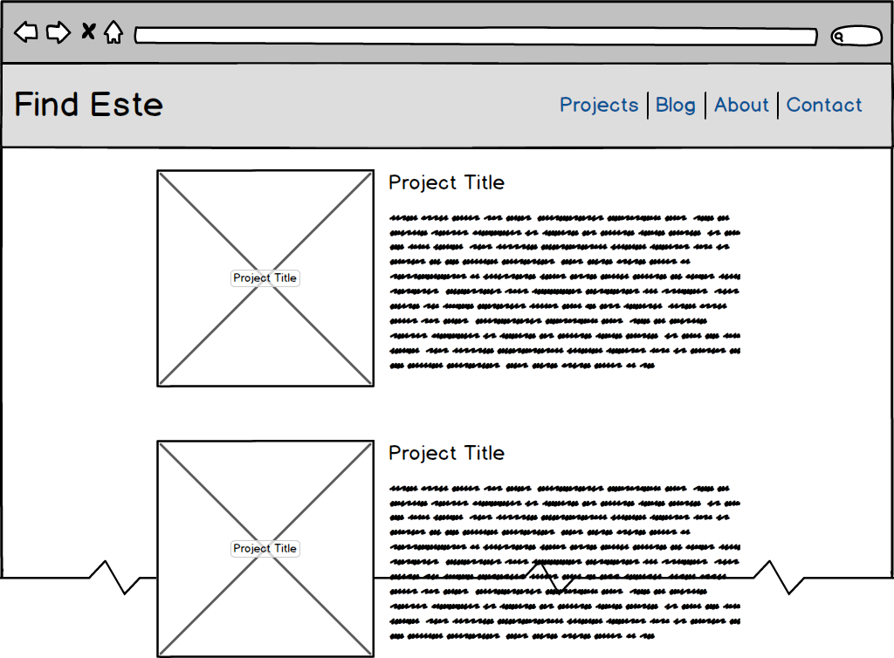
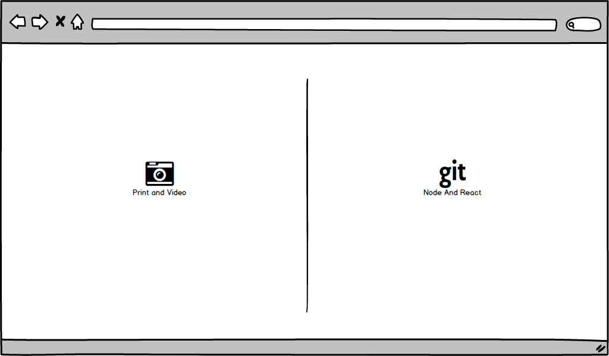

# Find Este Node and ReactJS Portfolio Site

## To Install

In the project directory, you can run:

### `npm start`

Runs the app in the development mode.<br>
Open [http://localhost:3000](http://localhost:3000) to view it in the browser.

## Folder Structure

```
my-app/
  README.md
  node_modules/
  package.json
  public/
    index.html
    favicon.ico
    mocks/
  src/
    App.css
    App.js
    App.test.js
    index.css
    index.js
    logo.svg
```

## Project Mockups


### Landing Page

- - -
### Splash Page



